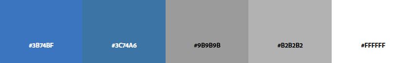

# 🛫 Proyecto: Aerolíneas Argentinas - Rediseño y Optimización

## 📍 Índice
1. [Análisis e Investigación](#analisis-e-investigacion)
2. [Diseño Visual](#diseño-visual)
3. [Prototipado](#prototipado)
4. [Desarrollo](#desarrollo)

## Analisis e Investigacion 🧠

### 🔷 Misión
Conectar a los argentinos y contribuir al desarrollo social y económico del país, promoviendo el territorio nacional como destino turístico, cultural y de negocios.

### 🔷 Visión
Ser la empresa emblema y orgullo de la República Argentina, reconocida por su gestión pública eficiente y transparente.

### 🔷 Valores
- Seguridad  
- Servicio de calidad  
- Conectividad  
- Transparencia  
- Eficiencia y rentabilidad  
- Inclusión  
- Sostenibilidad  

### 🎯 Objetivos

#### Generales
- Garantizar conectividad nacional e internacional.  
- Contribuir al desarrollo económico, social y cultural.  
- Ser líder en el mercado aéreo argentino.  

#### Estratégicos
- **Conectividad**: Optimizar la red doméstica.  
- **Compromiso social**: Apoyo en situaciones clave (sanitarias, emergencias).  
- **Compromiso operativo**: Maximizar eficiencia y reducir costos.  
- **Reorganización empresarial**: Fusión con Austral.  
- **Nuevos negocios**:  
  - Cargas  
  - Mantenimiento a terceros  
- **Inclusión**: Fomentar diversidad y respeto.  

### 👥 Público objetivo
- Turismo nacional: familias, parejas, residentes.  
- Turismo internacional: extranjeros y argentinos en el exterior.  
- Viajeros corporativos y gubernamentales.  
- Estudiantes y jóvenes.  
- Público con conciencia nacional.  

### 🛠 Necesidades y Desafíos Tecnológicos
- Transformación digital: mejora en reservas, check-in y atención.  
- Automatización y mantenimiento predictivo con IA e IoT.  
- Seguridad de datos.  
- Mejorar la experiencia del cliente.  
- Competitividad frente a low-cost.  
- Promociones y alianzas (SkyTeam).  

### 🆚 Análisis de Competencia

#### 1. Flybondi (Low-cost)
**Debilidades**:
- Infraestructura limitada  
- Flota pequeña  
- Servicio muy básico  
- Baja flexibilidad operativa  

#### 2. JetSMART Argentina (Low-cost extranjera)
**Debilidades**:
- Poca identificación con el público argentino  
- Marca menos consolidada  
- Frecuencia limitada en rutas  
- Dependencia de decisiones extranjeras  

### ✅ Oportunidades para Aerolíneas Argentinas
- Reforzar identidad nacional y emocional con los usuarios.  
- Aprovechar debilidades low-cost para destacar en servicio completo y frecuencia.  
- Ampliar rutas directas desde provincias (ventaja frente a hubs centralizados).  
- Crecer en áreas como carga aérea y mantenimiento a terceros.  

### 🔗 Links
- [Aerolíneas Argentinas - Compañía](https://www.aerolineas.com.ar/compania)  
- [Misión, Visión y Valores](https://www.aerolineas.com.ar/mision-vision-valores)  
- [Objetivos Estratégicos](https://www.aerolineas.com.ar/objetivos-estrategicos)  
- [Panorama del sector 2025](https://blog.wearedrew.co/noticias/industria-aerocomercial-en-argentina-panorama-actual-y-tendencias-para-el-2025?utm_source)  
- [Fallas Flybondi - CTA Córdoba](https://ctaacordoba.org/flybondi-una-por-una-las-fallas-de-la-low-cost-mas-denunciada-de-la-argentina/?utm_source)  
- [Fallas Flybondi - Contrapoder Web](https://contrapoderweb.com.ar/flybondi-una-por-una-las-fallas-de-la-low-cost-mas-denunciada-de-la-argentina/?utm_source)  
- [Puntualidad frente a low-cost](https://america-retail.com/paises/argentina/contra-el-relato-oficial-aerolineas-argentinas-destaca-en-puntualidad-frente-a-las-low-cost/?utm_source)  
- [Nueva ruta reinaugurada](https://www.iprofesional.com/actualidad/429978-aerolineas-argentinas-reinauguro-nueva-ruta-entre-dos-provincias-claves-del-pais?utm_source)

---

## 🎨 Diseño Visual

### 🖋 Fuente
- [Source Sans 3](https://fonts.google.com/specimen/Source+Sans+3)
  - Regular 400: `Mi reserva`
  - Regular 400 Italic: *Mi reserva*

### 🎨 Paleta de colores

---

## 🧪 Prototipado

Ver prototipo en Miro:  
👉 [Acceder al tablero](https://miro.com/app/board/uXjVIpiKVa8=/?share_link_id=817698885936) 

---

## 💻 Desarrollo

Tecnologías utilizadas:

- **HTML5**  
- **CSS3**  
- **JavaScript**  
- **Google Fonts** para tipografía ([Source Sans 3](https://fonts.google.com/specimen/Source+Sans+3))  
- **Bootstrap Icons** para íconos ([Ver íconos](https://icons.getbootstrap.com/))

---

## Autoras

**Melanie San Roman** y **Micaela Nicole Lopez**  
Carrera: Tecnicatura Universitaria en Desarrollo de Aplicaciones Informáticas (TUDAI)  
Materia: Interfaces de Usuario e Interacción  
Año: 3° año

---

¡Gracias por leer! 💻✨
